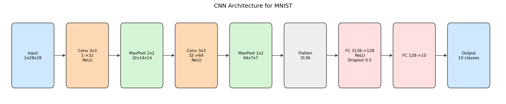
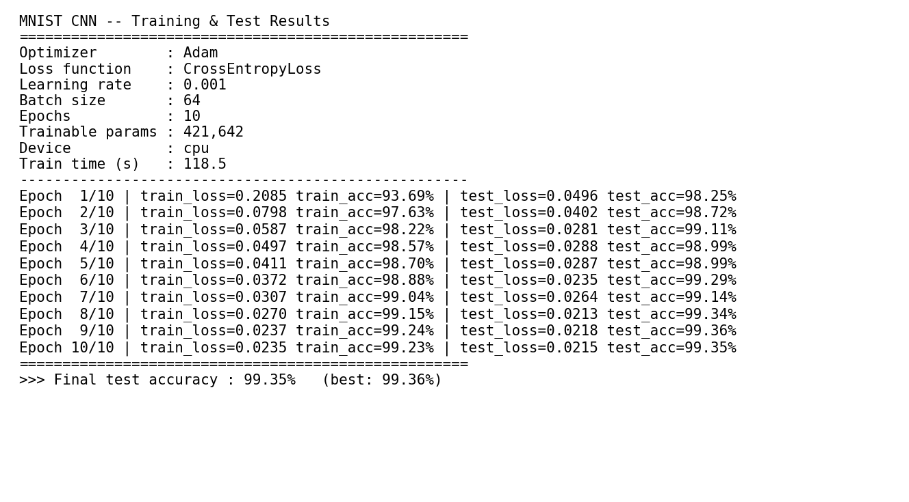
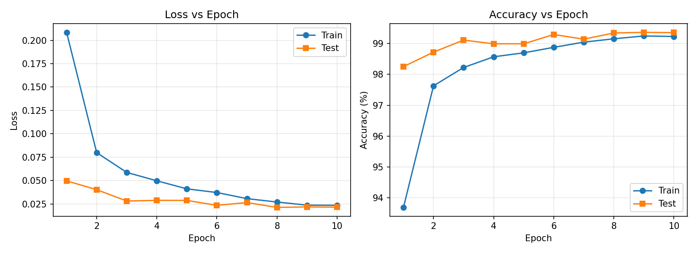
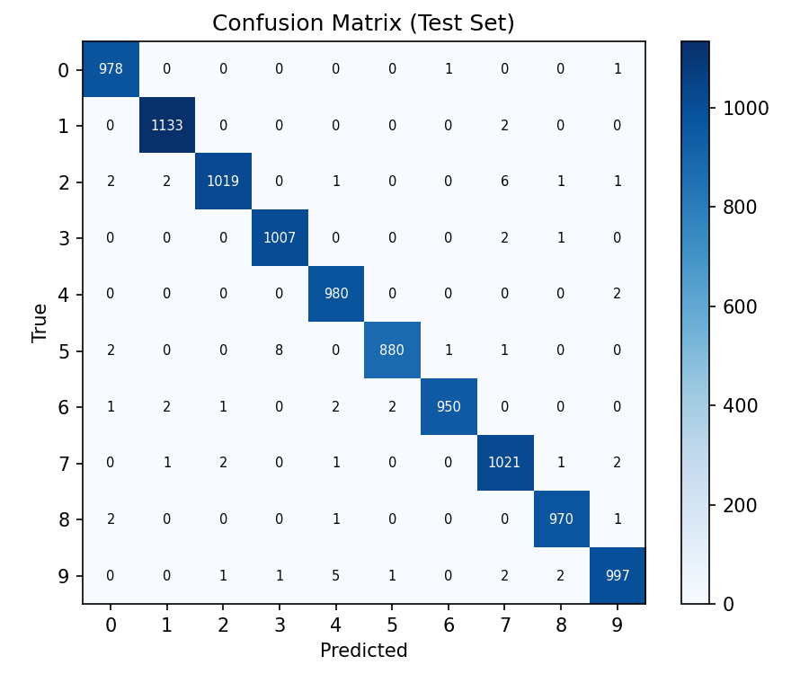
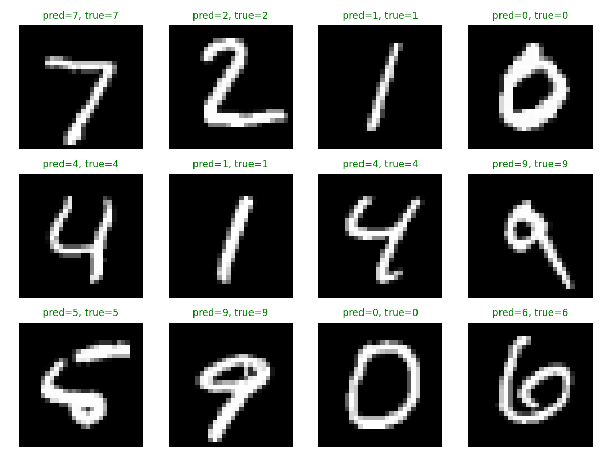

# 实验二　基于卷积神经网络的 MNIST 手写数字识别

| 项目 | 内容 |
| --- | --- |
| 实验名称 | 基于卷积神经网络的 MNIST 手写数字识别 |
| 专业班级 | （请填写） |
| 学　　号 | （请填写） |
| 姓　　名 | （请填写） |
| 实验日期 | （请填写） |

---

## 一、实验目的

1. 熟悉 PyTorch 深度学习框架的使用；
2. 熟悉卷积神经网络（CNN）的训练思路；
3. 掌握卷积神经网络对 MNIST 手写数字的识别过程。

## 二、实验内容

MNIST 数据库共有 7 万张手写数字图片，其中 6 万张用于训练、1 万张用于测试，每张图片大小为 28×28 像素（单通道灰度图），标签为 0~9 共 10 类。本实验使用 PyTorch 搭建一个卷积神经网络模型，完成对 MNIST 手写数字的识别任务，并对训练、测试结果进行分析。

## 三、实验设备与环境

- 计算机一台；
- PyTorch 深度学习框架；
- 具体环境：Python 3.12 + `torch 2.12.0 (CPU)` + `torchvision 0.27.0` + `matplotlib`。

## 四、实验步骤

实验严格按照「读取数据 → 创建模型 → 训练网络 → 测试网络 → 结果输出与分析」五个步骤进行，对应代码见 `train_mnist_cnn.py`。

### 4.1 读取数据（输入数据与目标输出数据）

- 使用 `torchvision.datasets.MNIST` 自动下载并加载训练集（60000 张）与测试集（10000 张）。
- 预处理：先 `ToTensor()` 把像素归一化到 `[0,1]`，再用 MNIST 全局均值/标准差 `Normalize((0.1307,), (0.3081,))` 做标准化，使输入分布更稳定、收敛更快。
- 训练集 `batch_size=64` 且 `shuffle=True`；测试集 `batch_size=1000` 不打乱。
- **输入数据**：形状为 `[N, 1, 28, 28]` 的图像张量；**目标输出数据**：形状为 `[N]` 的整数标签（0~9）。

### 4.2 创建卷积神经网络模型

网络结构示意图如下：



各层说明：

| 层 | 配置 | 输出尺寸 |
| --- | --- | --- |
| 输入 Input | 单通道灰度图 | 1 × 28 × 28 |
| 卷积层 Conv1 | 3×3，1→32，padding=1，ReLU | 32 × 28 × 28 |
| 池化层 Pool1 | MaxPool 2×2 | 32 × 14 × 14 |
| 卷积层 Conv2 | 3×3，32→64，padding=1，ReLU | 64 × 14 × 14 |
| 池化层 Pool2 | MaxPool 2×2 | 64 × 7 × 7 |
| 展平 Flatten | — | 3136 |
| 全连接 FC1 | 3136→128，ReLU，Dropout 0.5 | 128 |
| 全连接 FC2 | 128→10 | 10 |

- 两层「卷积 + ReLU + 最大池化」用于逐层提取局部边缘、笔画等空间特征，并通过池化降低分辨率、增强平移不变性；
- 全连接层把卷积特征映射到 10 个类别得分，`Dropout(0.5)` 用于抑制过拟合；
- 模型可训练参数总数：**421,642**。

### 4.3 训练网络

- 损失函数：交叉熵损失 `CrossEntropyLoss`（内部已含 Softmax，适合多分类）；
- 优化器：`Adam`，学习率 `lr = 0.001`；
- 迭代次数（Epochs）：`10`；每个 epoch 遍历一次全部训练数据，按 batch 做前向 → 计算损失 → 反向传播 → 参数更新；
- 随机种子固定为 `42`，保证结果可复现。

### 4.4 测试网络

每个 epoch 结束后，在 1 万张测试集上用 `model.eval()` + `torch.no_grad()` 模式评估损失与准确率（准确率 = 预测正确样本数 / 总样本数），并记录最优精度。

### 4.5 结果输出与分析

训练结束后输出：每轮的训练/测试损失与精度曲线、测试集混淆矩阵、预测示例图，并保存模型权重 `outputs/mnist_cnn.pt` 与统计信息 `outputs/summary.json`。

## 五、神经网络参数设置（汇总）

| 参数 | 取值 |
| --- | --- |
| 迭代次数 Epochs | 10 |
| 批大小 Batch size | 64 |
| 学习率 Learning rate | 0.001 |
| 优化器 Optimizer | Adam |
| 损失函数 Loss | CrossEntropyLoss（交叉熵） |
| 激活函数 | ReLU |
| 正则化 | Dropout(0.5) |
| 随机种子 | 42 |
| 可训练参数量 | 421,642 |

## 六、实验结果与分析

### 6.1 训练 / 测试日志与最终精度（精度截图）

下图为完整训练日志及最终测试精度（即「测试精度截图」）：



逐轮结果如下表：

| Epoch | 训练损失 | 训练精度 | 测试损失 | 测试精度 |
| --- | --- | --- | --- | --- |
| 1 | 0.2085 | 93.69% | 0.0496 | 98.25% |
| 2 | 0.0798 | 97.63% | 0.0402 | 98.72% |
| 3 | 0.0587 | 98.22% | 0.0281 | 99.11% |
| 4 | 0.0497 | 98.57% | 0.0288 | 98.99% |
| 5 | 0.0411 | 98.70% | 0.0287 | 98.99% |
| 6 | 0.0372 | 98.88% | 0.0235 | 99.29% |
| 7 | 0.0307 | 99.04% | 0.0264 | 99.14% |
| 8 | 0.0270 | 99.15% | 0.0213 | 99.34% |
| 9 | 0.0237 | 99.24% | 0.0218 | **99.36%** |
| 10 | 0.0235 | 99.23% | 0.0215 | 99.35% |

> **最终测试精度：99.35%（最佳 99.36%）**，CPU 训练总耗时约 118.5 秒。

### 6.2 损失与精度曲线



分析：
- 训练损失从 0.21 快速下降并趋于平稳，测试损失同步下降，说明模型有效学习且未出现明显过拟合；
- 测试精度在第 1 个 epoch 即达到 98.25%，第 3 个 epoch 后稳定在 99% 以上，最终收敛于 99.3% 左右；
- 训练精度与测试精度之间差距很小（约 0.1%），表明 Dropout 与较浅的网络结构有效控制了过拟合。

### 6.3 混淆矩阵



分析：
- 混淆矩阵对角线元素占绝对多数，说明绝大部分样本被正确分类；
- 非对角线误分类数量极少，较易混淆的情形主要集中在形状相近的数字之间（如 5↔3、4↔9、7↔2），符合手写数字的直观特点。

### 6.4 预测示例



随机抽取的测试样本预测全部正确（绿色标题表示预测=真实），直观验证了模型的识别能力。

## 七、结论

1. 本实验基于 PyTorch 成功搭建了一个包含 2 个卷积层、2 个池化层和 2 个全连接层的卷积神经网络，完成了 MNIST 手写数字识别任务；
2. 在 Epochs=10、batch_size=64、学习率=0.001、Adam 优化器、交叉熵损失的设置下，模型最终在 1 万张测试图片上达到 **99.35%（最佳 99.36%）** 的识别精度；
3. 卷积神经网络通过卷积+池化自动提取空间特征，相比全连接网络在图像任务上具有参数共享、平移不变、精度高的优势；
4. 进一步可尝试增加卷积层数、加入 BatchNorm、数据增强或调整学习率等手段，以追求更高精度或更快收敛。

## 八、复现方式

```bash
pip install -r requirements.txt
python train_mnist_cnn.py --epochs 10 --batch-size 64 --lr 0.001
python make_diagrams.py   # 生成网络结构图与结果面板
```

运行后：模型保存在 `outputs/mnist_cnn.pt`，统计信息在 `outputs/summary.json`，全部图表在 `report/figures/`。
