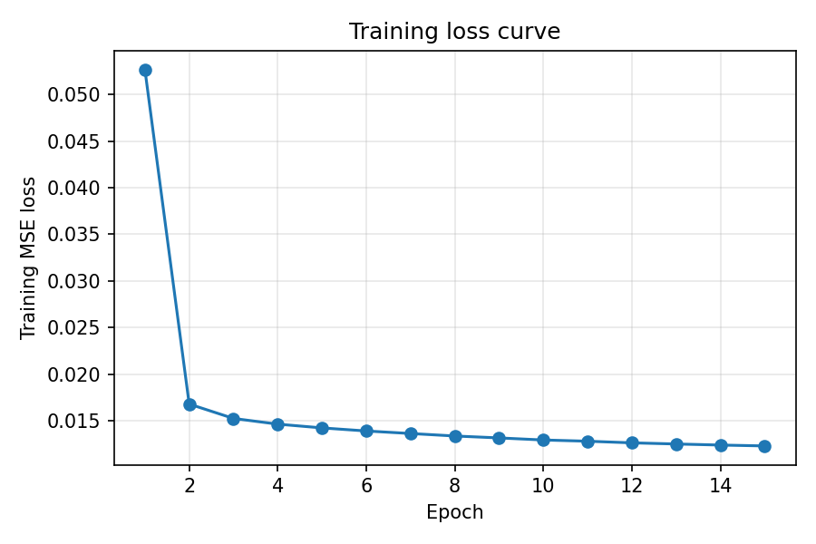
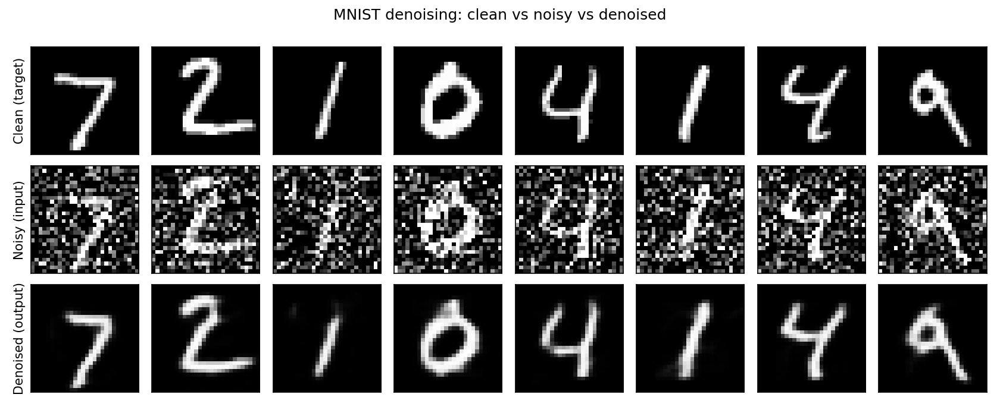

# 实验三 基于卷积神经网络的 MNIST 手写数字图片噪声处理

| 项目 | 内容 |
| --- | --- |
| 实验名称 | 基于卷积神经网络的 MNIST 手写数字图片噪声处理 |
| 专业班级 | （请填写） |
| 学　　号 | （请填写） |
| 姓　　名 | （请填写） |
| 实验日期 | （请填写） |

---

## 一、实验目的

1. 熟悉 PyTorch 深度学习框架的使用；
2. 熟悉卷积神经网络的训练思路；
3. 掌握卷积神经网络对图像噪声去除的过程。

## 二、实验内容

现实中的数字图像在数字化和传输过程中常受到成像设备或外部环境噪声干扰，
减少图像中噪声的过程称为图像去噪。本实验以 MNIST 手写数字数据库为训练数据，
搭建一个**卷积去噪自编码器（Convolutional Denoising Autoencoder）**模型实现图像去噪：

- **输入数据**：在干净 MNIST 图像上叠加高斯噪声后得到的“加噪图像”；
- **目标输出数据**：对应的原始“干净图像”；
- **学习目标**：让网络学习从“加噪图像”到“干净图像”的映射，从而去除噪声。

## 三、实验步骤

### 3.1 读取数据（输入数据与目标输出数据）

使用 `torchvision.datasets.MNIST` 自动下载 MNIST 数据集（训练集 60000 张、测试集 10000 张，
均为 28×28 单通道灰度图）。通过 `transforms.ToTensor()` 将像素归一化到 `[0, 1]`。

噪声采用**零均值高斯噪声**，并将结果裁剪回 `[0, 1]` 区间（`src/data.py`）：

```python
noisy = images + noise_factor * torch.randn_like(images)
noisy = torch.clamp(noisy, 0.0, 1.0)
```

其中 `noise_factor = 0.5`。训练时干净图像作为标签（target），加噪图像作为网络输入。

### 3.2 创建卷积神经网络模型

模型为对称的**编码器—解码器**结构（`src/model.py`）。编码器用卷积 + 最大池化逐步下采样、
提取特征并压缩到低维表示；解码器用转置卷积逐步上采样、重建出去噪后的图像；
最后用 `Sigmoid` 把输出限制到 `[0, 1]`。

**网络结构示意图：**

```
输入 噪声图像 (1 × 28 × 28)
        │
   ┌────┴──────────────── 编码器 Encoder ────────────────┐
   │  Conv2d(1→32, 3×3, pad=1) + ReLU                     │
   │  MaxPool2d(2×2)                 →  32 × 14 × 14       │
   │  Conv2d(32→64, 3×3, pad=1) + ReLU                    │
   │  MaxPool2d(2×2)                 →  64 ×  7 ×  7       │
   └──────────────────────┬───────────────────────────────┘
                          │  (瓶颈/特征表示)
   ┌──────────────────────┴──────────── 解码器 Decoder ───┐
   │  ConvTranspose2d(64→32, 2×2, s=2) + ReLU → 32×14×14  │
   │  ConvTranspose2d(32→16, 2×2, s=2) + ReLU → 16×28×28  │
   │  Conv2d(16→1, 3×3, pad=1) + Sigmoid       →  1×28×28 │
   └──────────────────────┬───────────────────────────────┘
        │
输出 去噪图像 (1 × 28 × 28)
```

| 层 | 类型 | 输出尺寸 |
| --- | --- | --- |
| 输入 | — | 1 × 28 × 28 |
| Conv1 + ReLU + MaxPool | 卷积 + 池化 | 32 × 14 × 14 |
| Conv2 + ReLU + MaxPool | 卷积 + 池化 | 64 × 7 × 7 |
| DeConv1 + ReLU | 转置卷积 | 32 × 14 × 14 |
| DeConv2 + ReLU | 转置卷积 | 16 × 28 × 28 |
| Conv3 + Sigmoid | 卷积 | 1 × 28 × 28 |

模型可训练参数量：**29,249**。

### 3.3 训练网络

- 损失函数：**均方误差 MSELoss**（去噪输出与干净目标之间的逐像素 MSE）；
- 优化器：**Adam**，学习率 `1e-3`；
- 训练流程：每个批次取干净图像→在线生成加噪图像→前向得到去噪输出→计算 MSE→反向传播→更新参数。

### 3.4 测试网络

在测试集（10000 张）上评估，采用以下指标：

- **MSE**（均方误差，越小越好）；
- **PSNR**（峰值信噪比，单位 dB，越大越好）；
- **SSIM**（结构相似性，取值 [0,1]，越大越好）。

同时计算“加噪输入 vs 干净图像”的 PSNR 作为**基线**，用于衡量网络的去噪提升幅度。

### 3.5 结果输出与分析

运行结束自动输出训练损失曲线、去噪对比图、`metrics.json` 指标文件及模型权重。

---

## 四、神经网络参数设置

| 参数 | 取值 |
| --- | --- |
| 迭代次数（epochs） | 15 |
| 批大小（batch size） | 128 |
| 学习率（learning rate） | 0.001 |
| 优化器（optimizer） | Adam |
| 损失函数（loss function） | MSELoss（均方误差） |
| 噪声类型 / 强度 | 高斯噪声 / noise_factor = 0.5 |
| 激活函数 | ReLU（隐藏层）、Sigmoid（输出层） |
| 设备 | CPU |

启动命令：

```bash
python src/main.py --epochs 15 --batch-size 128 --lr 1e-3 --noise-factor 0.5
```

---

## 五、实验结果与分析

### 5.1 训练损失曲线

随着迭代轮数增加，训练 MSE 损失从约 0.0527 快速下降并逐渐收敛到约 0.0123，
说明网络有效地学习到了去噪映射。



### 5.2 去噪效果对比（干净 / 加噪 / 去噪）

第一行为干净目标图像，第二行为加入高斯噪声后的输入图像（噪声很强、数字几乎被淹没），
第三行为网络去噪后的输出。可见网络成功去除了绝大部分噪声并较好地恢复了数字笔画。



### 5.3 测试精度（量化指标）

> 对于图像去噪任务，“模型精度”用重建图像与干净图像的接近程度衡量，
> 即 PSNR / SSIM / MSE。下表为测试集（10000 张）上的结果：

| 指标 | 加噪输入（基线） | 去噪输出（本模型） |
| --- | --- | --- |
| **PSNR** | 9.38 dB | **19.48 dB** |
| **SSIM** | — | **0.8313** |
| **MSE** | — | **0.012092** |

**测试控制台输出（用于截图存档）：**

```
=== Test results ===
Noisy input PSNR (baseline): 9.38 dB
Denoised MSE : 0.012092
Denoised PSNR: 19.48 dB
Denoised SSIM: 0.8313
```

### 5.4 结果分析

1. **去噪效果显著**：PSNR 由加噪输入的 9.38 dB 提升到去噪输出的 19.48 dB，
   提升约 **10 dB**；SSIM 达到 0.83，表明去噪图像在结构上与原图高度相似。
2. **收敛行为合理**：损失在前 2 个 epoch 急剧下降后平稳收敛，没有出现震荡或发散，
   说明学习率与优化器设置合适。
3. **编码器—解码器结构的作用**：编码器把图像压缩到 64×7×7 的特征表示，
   迫使网络保留“数字结构”这类主要信息而丢弃随机噪声；解码器再据此重建干净图像，
   因此能起到去噪作用。
4. **可改进方向**：
   - 增加训练轮数或加入跳跃连接（如 U-Net 结构）可进一步提升 PSNR/SSIM；
   - 可尝试不同噪声类型（椒盐噪声、泊松噪声）或不同噪声强度做鲁棒性对比；
   - 使用 GPU 训练可显著缩短训练时间，从而支持更大模型与更多迭代。

## 六、结论

本实验基于 PyTorch 搭建了卷积去噪自编码器，对叠加高斯噪声的 MNIST 手写数字图像进行去噪。
实验结果表明，该卷积神经网络能够有效去除图像噪声：测试集 PSNR 从 9.38 dB 提升至 **19.48 dB**，
SSIM 达 **0.83**，去噪图像在视觉上清晰地恢复了原始数字。实验验证了卷积神经网络
（编码器—解码器结构）在图像去噪任务中的有效性，也加深了对 PyTorch 框架与 CNN 训练流程的理解。
