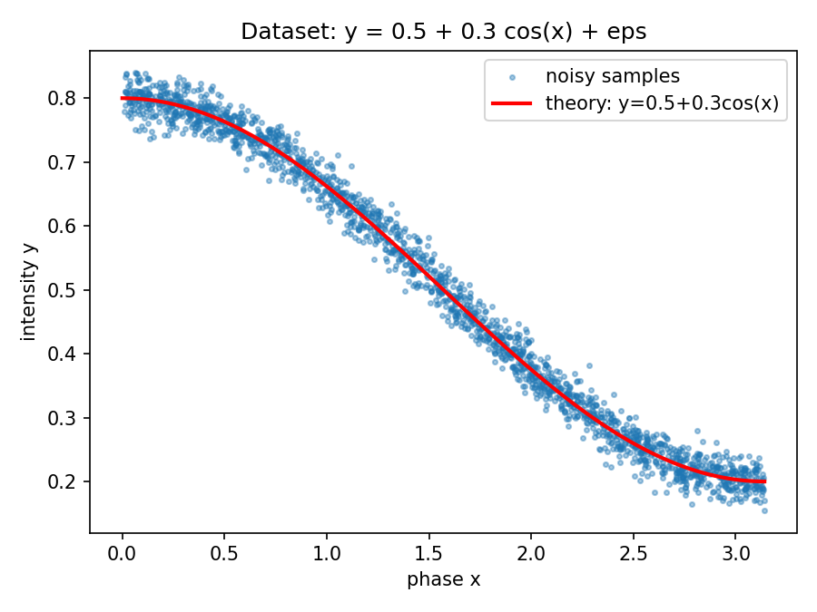
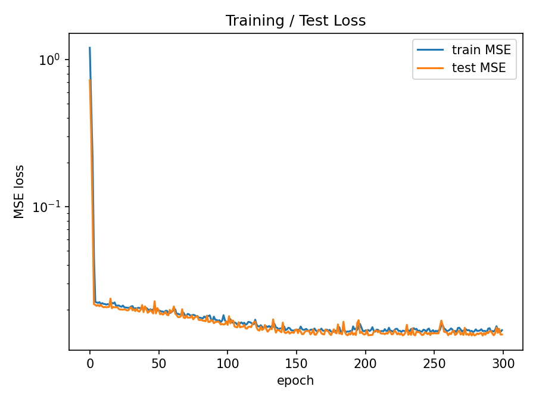
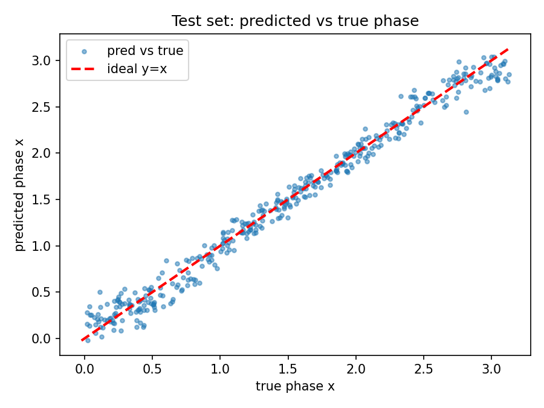
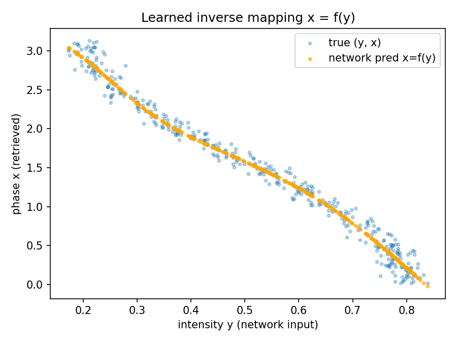

# 实验报告：基于人工神经网络的相位提取（PyTorch）

> 说明：以下封面信息请按实际情况填写。

| 项目 | 内容 |
| --- | --- |
| 实验名称 | 基于人工神经网络的相位—强度映射模型（相位提取） |
| 专业班级 | （请填写） |
| 学　　号 | （请填写） |
| 姓　　名 | （请填写） |
| 实验日期 | （请填写） |

---

## 一、实验目的

1. 熟悉 PyTorch 深度学习框架的基本使用；
2. 熟悉人工神经网络（多层感知机 MLP）的结构与原理；
3. 掌握神经网络的训练过程（前向传播、损失计算、反向传播、参数更新）。

## 二、实验内容

在测量信号中，相位 `x` 与强度信号 `y` 之间存在理论对应关系。为方便生成数据集，
假设数据符合如下函数关系：

$$ y = 0.5 + 0.3\cos(x) + \varepsilon,\qquad x \in (0, \pi) $$

其中 `ε` 为噪声分布（本实验取高斯噪声 `ε ~ N(0, 0.02²)`）。

要求建立人工神经网络，求解 `x` 与 `y` 的映射模型：**输入强度信号 `y`，提取出相位 `x` 的分布**，
并观察与分析实验结果。

> **关键说明（映射可行性）**：余弦函数 `cos(x)` 在区间 `(0, π)` 上严格单调递减，因此
> `y → x` 是一一对应（单射）的，反映射 `x = f(y)` 存在且唯一，可以用神经网络拟合。
> 若区间扩大到 `(0, 2π)`，同一个 `y` 会对应两个 `x`，映射不再唯一，网络将无法学到确定的反函数。

## 三、实验步骤

### 3.1 导入（生成）数据

- 在 `(0, π)` 内均匀采样 `N = 2000` 个相位 `x`（避开端点 0 与 π）；
- 按 `y = 0.5 + 0.3cos(x) + ε` 计算带噪强度 `y`；
- **网络的输入是强度 `y`，目标输出是相位 `x`**；
- 按 8:2 随机划分训练集（1600）与测试集（400）。

### 3.2 创建神经网络模型

采用一个简单的多层感知机（MLP）：

```
Linear(1, 64) → Tanh → Linear(64, 64) → Tanh → Linear(64, 1)
```

- 输入维度 1（强度 `y`），输出维度 1（相位 `x`）；
- 隐藏层各 64 个神经元，使用 `Tanh` 激活（输出连续平滑，适合回归曲线）；
- 可训练参数量：**4353**。

### 3.3 训练、测试网络

- 损失函数：均方误差 `MSELoss`；
- 优化器：`Adam`，学习率 `1e-3`；
- 批大小 `batch_size = 64`，训练 `300` 个 epoch；
- 每个 epoch 在测试集上评估一次，记录训练/测试损失曲线。

### 3.4 应用网络与结果输出

- 在测试集上用训练好的网络提取相位，计算 MAE、RMSE；
- 给定若干强度值演示相位提取，并与解析解 `x = arccos((y-0.5)/0.3)` 对比；
- 绘制并保存 4 张结果图到 `results/`。

### 主要参数设置一览

| 参数 | 取值 | 说明 |
| --- | --- | --- |
| 样本数 `N_SAMPLES` | 2000 | 数据集总样本数 |
| 噪声标准差 `NOISE_STD` | 0.02 | 高斯噪声 `ε` 的标准差 |
| 测试集比例 `TEST_RATIO` | 0.2 | 训练:测试 = 8:2 |
| 网络结构 | 1-64-64-1 | MLP，Tanh 激活 |
| 损失函数 | MSE | 均方误差 |
| 优化器 | Adam | — |
| 学习率 `LR` | 1e-3 | — |
| 批大小 `BATCH_SIZE` | 64 | — |
| 训练轮数 `EPOCHS` | 300 | — |
| 随机种子 `SEED` | 42 | 保证结果可复现 |

> 报告要求“对主要参数设置截图详细列出”。上表对应代码 `phase_retrieval.py` 顶部的
> “全局参数设置”区块，请在本地运行后对该代码块及控制台输出截图附在报告中。

## 四、PyTorch 神经网络代码

完整代码见仓库文件 [`phase_retrieval.py`](phase_retrieval.py)。核心片段如下：

```python
# 1. 数据生成: y = 0.5 + 0.3*cos(x) + eps, x in (0, pi)
def generate_data(n_samples, noise_std):
    x = np.random.uniform(1e-3, np.pi - 1e-3, size=(n_samples, 1))
    eps = np.random.normal(0.0, noise_std, size=(n_samples, 1))
    y = 0.5 + 0.3 * np.cos(x) + eps
    return x.astype(np.float32), y.astype(np.float32)

# 2. 网络模型: 输入强度 y, 输出相位 x
class PhaseNet(nn.Module):
    def __init__(self, hidden=64):
        super().__init__()
        self.net = nn.Sequential(
            nn.Linear(1, hidden), nn.Tanh(),
            nn.Linear(hidden, hidden), nn.Tanh(),
            nn.Linear(hidden, 1),
        )
    def forward(self, x):
        return self.net(x)

# 3. 训练: Adam + MSE
criterion = nn.MSELoss()
optimizer = torch.optim.Adam(model.parameters(), lr=1e-3)
for epoch in range(EPOCHS):
    for yb, xb in train_loader:        # 注意: 输入 y, 目标 x
        optimizer.zero_grad()
        loss = criterion(model(yb), xb)
        loss.backward()
        optimizer.step()

# 4. 应用: 输入强度 y, 提取相位 x
with torch.no_grad():
    x_pred = model(y_test_t)
```

## 五、实验结果与分析

### 5.1 数据集

数据点紧密围绕理论曲线 `y = 0.5 + 0.3cos(x)` 分布，噪声幅度适中。



### 5.2 训练过程

训练与测试损失同步快速下降并收敛，二者基本重合，**没有出现过拟合**：
最终 `train MSE ≈ 0.0145`，`test MSE ≈ 0.0135`。



### 5.3 测试集结果

| 指标 | 数值 |
| --- | --- |
| 平均绝对误差 MAE | **0.0906 rad** |
| 均方根误差 RMSE | **0.1164 rad** |

预测相位与真实相位散点紧贴 `y = x` 对角线，说明网络成功学到了 `y → x` 的映射关系。



### 5.4 网络学到的反映射 `x = f(y)`

网络输出（橙色）形成一条平滑单调的曲线，与真实样本（蓝色）走势一致，
直观验证了“输入强度 `y` 即可提取相位 `x`”。



### 5.5 相位提取应用示例

| 输入强度 `y` | 网络预测 `x` (rad) | 解析解 `x` (rad) |
| --- | --- | --- |
| 0.200 | 2.9092 | 3.1416 |
| 0.500 | 1.5784 | 1.5708 |
| 0.800 | 0.2111 | 0.0000 |

### 5.6 分析与讨论（个人见解）

1. **端点误差较大**：在 `y` 接近极值（`x → 0` 或 `x → π`）时，预测误差明显偏大。
   原因是 `dy/dx = -0.3sin(x)` 在端点处趋于 0，曲线近乎水平，**强度对相位不敏感**，
   同样大小的噪声会被反映射放大成很大的相位误差。这是问题本身的病态性，并非网络缺陷。
2. **中间区域（`x ≈ π/2`）精度最高**：此处 `|dy/dx|` 最大，映射对噪声最不敏感。
3. **未过拟合**：训练/测试损失曲线几乎重合，模型容量与数据规模匹配良好。
4. **可改进方向**：
   - 增大样本量或降低噪声 `NOISE_STD` 可整体降低误差；
   - 适当增加网络深度/宽度或延长训练，对中间区域帮助有限，主要受端点病态性限制；
   - 端点附近可通过加密采样或加权损失来缓解误差放大。

## 六、结论

1. 成功用 PyTorch 搭建并训练了一个 MLP，实现了从强度 `y` 到相位 `x` 的反映射模型；
2. 由于 `cos(x)` 在 `(0, π)` 上单调，`y → x` 映射唯一，网络能够稳定收敛并准确提取相位
   （测试集 RMSE ≈ 0.12 rad）；
3. 误差主要集中在曲线端点，源于映射在该处的病态性（灵敏度趋零），与噪声放大有关；
4. 实验完整覆盖了“数据导入 → 建模 → 训练测试 → 应用输出”的人工神经网络工作流程，
   达到了熟悉 PyTorch、理解神经网络与训练过程的实验目的。
